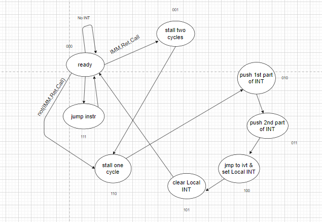

<div align="center">

[](https://github.com/ZeyadTarekk/RISC-Pipelined-Processor/contributors)
[](https://github.com/ZeyadTarekk/RISC-Pipelined-Processor/issues)
[](https://github.com/ZeyadTarekk/RISC-Pipelined-Processor/blob/master/LICENSE)
[](https://github.com/ZeyadTarekk/RISC-Pipelined-Processor/network)
[](https://github.com/ZeyadTarekk/RISC-Pipelined-Processor/stargazers)
[](https://img.shields.io/github/languages/count/ZeyadTarekk/RISC-Pipelined-Processor)

</div>

## 📝 Table of Contents

- [About](#about)
- [Design](#design)
- [Implemented Instructions](#implemented-instructions)
- [Contributors](#contributors)
- [License](#license)

## About <a name = "about"></a>


- In this project, we apply a Harvard architecture with two memory units; Instructions’ memory and Data memory.
- The processor in this project has a RISC-like instruction set architecture. There are eight 2-bytes general purpose registers [ R0 to R7]. These registers are separate from the program counter and the stack pointer registers.
- The program counter (PC) spans the instructions memory address space that has a total size of 2 Megabytes. Each memory address has a 16-bit width (i.e., is word addressable). The instructions memory starts with the interrupts area (the very first address space from [0 down to 25-1]), followed by the instructions area (starting from [25and down to 220]) as shown in Figure.1. By default, the PC is initialized with a value of (25) where the program code starts.
- The other memory unit is the data memory, which has a total size of 4 Kilobytes for its own, 16-bit in width (i.e., is word addressable). The processor can access both memory units at the same time without having a memory access hazard.
- The data memory starts with the data area (the very first address space and down), followed by the stack area (starting from [211−1 and up]) as shown in Figure.1. By default, the stack pointer (SP) pointer points to the top of the stack (the next free address available in the stack), and is initialized by a value of (211-1).
- When an interrupt occurs, the processor finishes the currently fetched instructions (instructions that have already entered the pipeline), save the processor state (Flags), then the address of the next instruction (in PC) is saved on top of the stack, and PC is loaded from address 0 of the memory where the interrupt code resides.
- To return from an interrupt, an RTI instruction loads the PC from the top of stack, restores the processor state (Flags), and the flow of the program resumes from the instruction that was supposed to be fetched in-order before handling the interrupted instruction.

## Design <a name = "design"></a>

<div align="center">
   
</div>

### Interrupt state machine

<div align="center">
   
</div>


## Implemented Instructions <a name = "implemented-instructions"></a>
### ☝️ One Operand
```
NOP
SETC
CLRC
NOT Rdst
INC Rdst
DEC Rdst
OUT Rdst
IN Rdst
```
### ✌️ Two Operands
```
MOV Rsrc, Rdst
ADD Rsrc, Rdst
SUB Rsrc, Rdst
AND Rsrc, Rdst
OR Rsrc, Rdst
SHL Rsrc, Imm
SHR Rsrc, Imm
```

### 💾 Memory
```
PUSH  Rdst
POP  Rdst
LDM  Rdst, Imm
LDD Rsrc, Rdst
STD Rsrc, Rdst
```

### 🦘 Branch Instructions
```
JZ  Rdst
JN  Rdst
JC Rdst
JMP  Rdst
CALL Rdst
RET
RTI
```
### 👉 Input Signals
```
Reset
Interrupt
```


### Contributors <a name = "Contributors"></a>

<table>
  <tr>
    <td align="center">
    <a href="https://github.com/ZeyadTarekk" target="_black">
    
    <br />
    <sub><b>Zeyad Tarek</b></sub></a>
    </td>
    <td align="center">
    <a href="https://github.com/BeshoyMorad" target="_black">
    
    <br />
    <sub><b>Beshoy Morad</b></sub></a>
    </td>
    <td align="center">
    <a href="https://github.com/Waer1" target="_black">
    
    <br />
    <sub><b>Youssef Elwaer</b></sub></a>
    </td>
    <td align="center">
    <a href="https://github.com/ZiadSheriif" target="_black">
    
    <br />
    <sub><b>Ziad Sherif</b></sub></a>
    </td>
  </tr>
 </table>

 ## License <a name = "license"></a>

> This software is licensed under MIT License, See [License](https://github.com/ZeyadTarekk/RISC-Pipelined-Processor/blob/main/LICENSE) for more information.